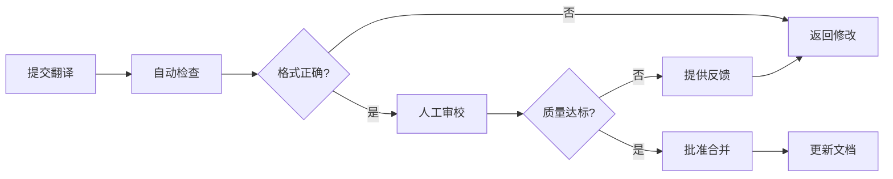

# QueryWeaver 翻译贡献指南

欢迎参与 QueryWeaver 的国际化工作！本指南将帮助您了解如何贡献高质量的翻译，确保全球用户都能获得优秀的使用体验。

## 目录

- [为什么需要您的帮助](#为什么需要您的帮助)
- [翻译质量标准](#翻译质量标准)
- [贡献流程](#贡献流程)
- [翻译审校流程](#翻译审校流程)
- [翻译工具和资源](#翻译工具和资源)
- [常见翻译问题](#常见翻译问题)
- [翻译风格指南](#翻译风格指南)
- [术语表](#术语表)

## 为什么需要您的帮助

QueryWeaver 致力于为全球用户提供优质的 Text2SQL 工具。准确、自然的翻译能够：

- **降低使用门槛**: 让更多非英语用户能够轻松使用
- **提升用户体验**: 本地化的表达更符合用户习惯
- **扩大用户群体**: 吸引更多国家和地区的用户
- **促进社区发展**: 多语言支持有助于建立全球化社区

## 翻译质量标准

### 1. 准确性 (Accuracy)

翻译必须准确传达原文含义，不能遗漏或添加信息。

**✅ 好的示例**:
```json
// 原文
"Connect to your database"

// 中文翻译
"连接到您的数据库"
```

**❌ 不好的示例**:
```json
// 原文
"Connect to your database"

// 中文翻译（过度翻译）
"立即连接到您的数据库并开始查询"
```

### 2. 一致性 (Consistency)

相同的概念在整个应用中应使用相同的翻译。

**术语一致性示例**:
- "Database" 统一翻译为 "数据库"，不要混用 "数据库"、"资料库"、"DB"
- "Query" 统一翻译为 "查询"，不要混用 "查询"、"询问"、"搜索"
- "Schema" 统一翻译为 "模式"，不要混用 "模式"、"架构"、"结构"

### 3. 自然性 (Naturalness)

翻译应符合目标语言的表达习惯，避免生硬的直译。

**✅ 好的示例**:
```json
// 原文
"No database selected"

// 中文翻译（自然）
"未选择数据库"
```

**❌ 不好的示例**:
```json
// 原文
"No database selected"

// 中文翻译（生硬）
"没有数据库被选择"
```

### 4. 简洁性 (Conciseness)

在保持准确的前提下，翻译应尽可能简洁明了。

**✅ 好的示例**:
```json
// 原文
"Save"

// 中文翻译
"保存"
```

**❌ 不好的示例**:
```json
// 原文
"Save"

// 中文翻译（过于冗长）
"保存当前内容"
```

### 5. 专业性 (Professionalism)

使用专业、规范的技术术语，避免口语化或非正式表达。

**✅ 好的示例**:
```json
// 原文
"Authentication failed"

// 中文翻译
"认证失败"
```

**❌ 不好的示例**:
```json
// 原文
"Authentication failed"

// 中文翻译（过于口语化）
"登不上去了"
```

### 6. 文化适应性 (Cultural Adaptation)

考虑目标语言的文化背景，适当调整表达方式。

**示例**:
```json
// 原文
"Oops! Something went wrong"

// 中文翻译（文化适应）
"抱歉，出现了一些问题"

// 而不是直译
"哎呀！有些东西出错了"
```

## 贡献流程

### 步骤 1: 准备工作

1. **Fork 项目仓库**
   ```bash
   # 在 GitHub 上 Fork QueryWeaver 仓库
   # 然后克隆到本地
   git clone https://github.com/YOUR_USERNAME/QueryWeaver.git
   cd QueryWeaver
   ```

2. **创建翻译分支**
   ```bash
   git checkout -b i18n/update-zh-CN-translations
   ```

3. **安装依赖**
   ```bash
   cd app
   npm install
   ```

### 步骤 2: 进行翻译

1. **找到需要翻译的文件**
   
   翻译文件位于 `app/src/i18n/locales/` 目录下：
   ```
   app/src/i18n/locales/
   ├── zh-CN/              # 中文翻译
   │   ├── common.json
   │   ├── auth.json
   │   ├── database.json
   │   ├── chat.json
   │   ├── schema.json
   │   └── errors.json
   └── en-US/              # 英文原文
       └── ...
   ```

2. **编辑翻译文件**
   
   使用文本编辑器打开需要修改的 JSON 文件：
   ```json
   {
     "buttons": {
       "save": "保存",
       "cancel": "取消",
       "delete": "删除"
     }
   }
   ```

3. **遵循 JSON 格式**
   - 保持 JSON 结构不变
   - 只修改值（引号内的文本），不要修改键
   - 注意保留插值变量 `{{variable}}`
   - 确保 JSON 语法正确（逗号、引号、括号）

### 步骤 3: 测试翻译

1. **启动开发服务器**
   ```bash
   npm run dev
   ```

2. **在浏览器中测试**
   - 访问 http://localhost:5173
   - 切换到您翻译的语言
   - 检查所有页面和功能
   - 确认翻译显示正确

3. **检查翻译完整性**
   ```bash
   # 运行翻译检查工具（如果有）
   npm run i18n:check
   ```

### 步骤 4: 提交更改

1. **提交翻译**
   ```bash
   git add app/src/i18n/locales/
   git commit -m "i18n: 更新中文翻译 - 修复数据库模块翻译"
   ```

2. **推送到远程仓库**
   ```bash
   git push origin i18n/update-zh-CN-translations
   ```

### 步骤 5: 创建 Pull Request

1. 在 GitHub 上创建 Pull Request
2. 填写 PR 描述：
   ```markdown
   ## 翻译更新
   
   ### 更改内容
   - 更新了数据库模块的中文翻译
   - 修复了部分术语不一致的问题
   - 优化了错误消息的表达
   
   ### 测试情况
   - [x] 已在本地测试所有更改
   - [x] 翻译显示正确
   - [x] 没有 JSON 语法错误
   
   ### 相关 Issue
   Closes #123
   ```

3. 等待审校和反馈

## 翻译审校流程

### 审校标准

翻译提交后，审校人员将检查以下方面：

1. **准确性检查**
   - 翻译是否准确传达原文含义
   - 是否有遗漏或添加的信息
   - 技术术语是否正确

2. **一致性检查**
   - 术语翻译是否一致
   - 风格是否统一
   - 是否符合项目术语表

3. **自然性检查**
   - 表达是否符合目标语言习惯
   - 是否有生硬的直译
   - 语句是否流畅

4. **格式检查**
   - JSON 格式是否正确
   - 插值变量是否保留
   - 标点符号是否正确

### 审校流程



### 审校时间

- **小型更改**（< 50 个键）: 1-2 个工作日
- **中型更改**（50-200 个键）: 3-5 个工作日
- **大型更改**（> 200 个键）: 1-2 周

### 反馈处理

如果审校人员提出修改建议：

1. 仔细阅读反馈意见
2. 在原分支上进行修改
3. 提交新的 commit
4. 在 PR 中回复说明修改内容
5. 等待再次审校

## 翻译工具和资源

### 推荐工具

#### 1. VS Code 扩展

- **i18n Ally**: 可视化翻译管理
  ```bash
  # 安装
  code --install-extension lokalise.i18n-ally
  ```
  
  功能：
  - 内联显示翻译
  - 快速跳转到翻译文件
  - 检测缺失的翻译
  - 翻译进度统计

- **JSON Tools**: JSON 格式化和验证
  ```bash
  code --install-extension eriklynd.json-tools
  ```

#### 2. 在线工具

- **DeepL**: 高质量机器翻译（仅供参考）
  - https://www.deepl.com/translator
  - 注意：机器翻译需要人工审校

- **Google Translate**: 快速翻译参考
  - https://translate.google.com/
  - 注意：不要直接使用机器翻译结果

- **术语在线**: 专业术语查询
  - https://www.termonline.cn/
  - 查询标准技术术语翻译

#### 3. 命令行工具

```bash
# 检查 JSON 格式
npm run i18n:validate

# 查找缺失的翻译键
npm run i18n:missing

# 生成翻译统计报告
npm run i18n:stats
```

### 参考资源

#### 官方文档

- [i18next 文档](https://www.i18next.com/)
- [React i18next 文档](https://react.i18next.com/)
- [Unicode CLDR](http://cldr.unicode.org/) - 本地化数据标准

#### 翻译指南

- [Microsoft 本地化风格指南](https://www.microsoft.com/en-us/language/styleguides)
- [Apple 人机界面指南](https://developer.apple.com/design/human-interface-guidelines/)
- [Google Material Design 本地化](https://material.io/design/communication/writing.html)

#### 术语词典

- [计算机术语翻译](https://github.com/JuanitoFatas/Computer-Science-Glossary)
- [微软术语搜索](https://www.microsoft.com/en-us/language/Search)
- [全国科学技术名词审定委员会](http://www.termonline.cn/)

## 常见翻译问题

### Q1: 如何翻译技术术语？

**A**: 遵循以下原则：

1. **使用行业标准翻译**
   ```json
   "database" → "数据库" (不是 "资料库")
   "query" → "查询" (不是 "询问")
   "schema" → "模式" (不是 "架构")
   ```

2. **首次出现时提供英文对照**（仅在文档中）
   ```
   "模式 (Schema)"
   ```

3. **保留专有名词**
   ```json
   "PostgreSQL" → "PostgreSQL" (不翻译)
   "MySQL" → "MySQL" (不翻译)
   "OAuth" → "OAuth" (不翻译)
   ```

### Q2: 如何处理插值变量？

**A**: 保持变量不变，只翻译周围的文本：

```json
// ✅ 正确
{
  "connected": "已连接: {{name}}",
  "rows": "{{count}} 行"
}

// ❌ 错误
{
  "connected": "已连接: {{名称}}",  // 不要翻译变量名
  "rows": "{{数量}} 行"            // 不要翻译变量名
}
```

### Q3: 如何处理复数形式？

**A**: 中文通常不区分单复数，但要保持语义清晰：

```json
{
  "result_one": "{{count}} 个结果",
  "result_other": "{{count}} 个结果"
}
```

### Q4: 标点符号如何使用？

**A**: 使用目标语言的标点符号规范：

**中文标点**:
- 使用中文标点：，。！？：；""''
- 不使用英文标点：,.!?:;""''

```json
// ✅ 正确
"description": "使用连接 URL 或手动输入连接到数据库。"

// ❌ 错误
"description": "使用连接 URL 或手动输入连接到数据库."
```

**例外情况**:
- 技术内容中的标点保持英文：`SELECT * FROM users;`
- URL 和代码中的标点不变

### Q5: 如何翻译按钮文本？

**A**: 按钮文本应简洁、动作明确：

```json
// ✅ 好的按钮文本
{
  "save": "保存",
  "cancel": "取消",
  "delete": "删除",
  "connect": "连接"
}

// ❌ 不好的按钮文本
{
  "save": "保存当前内容",      // 过长
  "cancel": "取消操作",        // 冗余
  "delete": "删除这个项目",    // 过于具体
  "connect": "点击连接"        // 不必要的提示
}
```

### Q6: 如何翻译错误消息？

**A**: 错误消息应清晰、有帮助：

```json
// ✅ 好的错误消息
{
  "connectionFailed": "连接数据库失败",
  "invalidUrl": "无效的数据库连接 URL",
  "timeout": "连接超时，请检查网络连接"
}

// ❌ 不好的错误消息
{
  "connectionFailed": "出错了",           // 不够具体
  "invalidUrl": "URL 不对",              // 过于口语化
  "timeout": "连接超时了哦"              // 不够专业
}
```

## 翻译风格指南

### 语气和风格

#### 1. 专业但友好

保持专业性的同时，使用友好的语气：

```json
// ✅ 推荐
"welcome": "欢迎使用 QueryWeaver"
"error": "抱歉，出现了一些问题"

// ❌ 不推荐
"welcome": "您好，欢迎您使用 QueryWeaver 系统"  // 过于正式
"error": "糟糕！系统崩溃了！"                  // 过于随意
```

#### 2. 简洁明了

避免冗长的表达：

```json
// ✅ 推荐
"loading": "加载中..."
"success": "操作成功"

// ❌ 不推荐
"loading": "正在为您加载数据，请稍候..."
"success": "您的操作已经成功完成了"
```

#### 3. 一致的人称

统一使用第二人称 "您" 或省略人称：

```json
// ✅ 推荐（使用 "您"）
"profile": "您的个人资料"
"settings": "您的设置"

// ✅ 推荐（省略人称）
"profile": "个人资料"
"settings": "设置"

// ❌ 不推荐（混用）
"profile": "您的个人资料"
"settings": "我的设置"  // 不一致
```

### 格式规范

#### 1. 数字和单位

```json
// 数字使用阿拉伯数字
"timeout": "连接超时（30 秒）"

// 大数字使用中文单位
"users": "10 万用户"
"records": "1.5 亿条记录"
```

#### 2. 日期和时间

```json
// 使用中文格式
"date": "2025年1月15日"
"time": "14:30"
"datetime": "2025年1月15日 14:30"
```

#### 3. 列表和枚举

```json
// 使用顿号分隔
"features": "查询、分析、可视化"

// 使用中文序号
"steps": "第一步：连接数据库；第二步：输入查询"
```

## 术语表

### 核心术语

| 英文 | 中文 | 说明 |
|------|------|------|
| Database | 数据库 | 不使用 "资料库" |
| Query | 查询 | 不使用 "询问"、"搜索" |
| Schema | 模式 | 不使用 "架构"、"结构" |
| Table | 表 | 数据库表 |
| Column | 列 | 表的列 |
| Row | 行 | 表的行 |
| Connection | 连接 | 数据库连接 |
| Authentication | 认证 | 不使用 "验证" |
| Authorization | 授权 | 不使用 "权限" |
| Token | 令牌 | API 令牌 |

### 界面术语

| 英文 | 中文 | 说明 |
|------|------|------|
| Button | 按钮 | UI 按钮 |
| Modal | 模态框 | 不使用 "对话框" |
| Dropdown | 下拉菜单 | 不使用 "下拉框" |
| Tooltip | 工具提示 | 不使用 "提示框" |
| Placeholder | 占位符 | 输入框占位文本 |
| Loading | 加载中 | 加载状态 |
| Error | 错误 | 错误状态 |
| Success | 成功 | 成功状态 |

### 操作术语

| 英文 | 中文 | 说明 |
|------|------|------|
| Save | 保存 | 保存操作 |
| Cancel | 取消 | 取消操作 |
| Delete | 删除 | 删除操作 |
| Edit | 编辑 | 编辑操作 |
| Create | 创建 | 创建操作 |
| Update | 更新 | 更新操作 |
| Refresh | 刷新 | 刷新操作 |
| Upload | 上传 | 上传操作 |
| Download | 下载 | 下载操作 |
| Export | 导出 | 导出操作 |
| Import | 导入 | 导入操作 |

### 技术术语

| 英文 | 中文 | 说明 |
|------|------|------|
| API | API | 不翻译 |
| REST | REST | 不翻译 |
| JSON | JSON | 不翻译 |
| SQL | SQL | 不翻译 |
| PostgreSQL | PostgreSQL | 不翻译 |
| MySQL | MySQL | 不翻译 |
| OAuth | OAuth | 不翻译 |
| URL | URL | 不翻译 |
| HTTP | HTTP | 不翻译 |
| HTTPS | HTTPS | 不翻译 |

## 翻译示例

### 示例 1: 数据库连接模块

```json
{
  "modal": {
    "title": "连接到数据库",
    "description": "使用连接 URL 或手动输入连接到 PostgreSQL 或 MySQL 数据库。",
    "privacyPolicy": "隐私政策"
  },
  "fields": {
    "databaseType": "数据库类型",
    "connectionUrl": "连接 URL",
    "host": "主机",
    "port": "端口",
    "database": "数据库名称",
    "username": "用户名",
    "password": "密码"
  },
  "messages": {
    "connecting": "正在连接...",
    "connected": "连接成功",
    "connectionFailed": "连接失败",
    "deleteConfirm": "确定要删除数据库 \"{{name}}\" 吗？"
  }
}
```

### 示例 2: 错误消息

```json
{
  "auth": {
    "notAuthenticated": "未认证。请登录以连接数据库。",
    "accessDenied": "访问被拒绝。您没有权限连接数据库。",
    "sessionExpired": "会话已过期。请重新登录。"
  },
  "database": {
    "invalidUrl": "无效的数据库连接 URL。",
    "connectionFailed": "连接数据库失败",
    "connectionTimeout": "连接超时。请检查网络连接。",
    "queryFailed": "查询执行失败"
  },
  "network": {
    "offline": "网络连接已断开",
    "timeout": "请求超时",
    "serverError": "服务器错误。请稍后重试。"
  }
}
```

## 获得帮助

如果您在翻译过程中遇到问题：

1. **查看文档**
   - [国际化开发指南](i18n-development-guide.md)
   - [项目 README](../README.md)

2. **提问讨论**
   - GitHub Discussions: https://github.com/FalkorDB/QueryWeaver/discussions
   - Discord 社区: https://discord.gg/b32KEzMzce

3. **报告问题**
   - GitHub Issues: https://github.com/FalkorDB/QueryWeaver/issues
   - 使用标签: `i18n`, `translation`

4. **联系维护者**
   - 在 PR 中 @mention 维护者
   - 发送邮件至项目邮箱

## 致谢

感谢所有为 QueryWeaver 国际化做出贡献的译者！您的工作让更多用户能够使用这个工具。

### 贡献者名单

查看完整的贡献者名单：
- [GitHub Contributors](https://github.com/FalkorDB/QueryWeaver/graphs/contributors)
- [翻译贡献者](https://github.com/FalkorDB/QueryWeaver/blob/main/TRANSLATORS.md)

---

**最后更新**: 2025-01-15  
**维护者**: QueryWeaver 开发团队  
**版本**: 1.0.0
